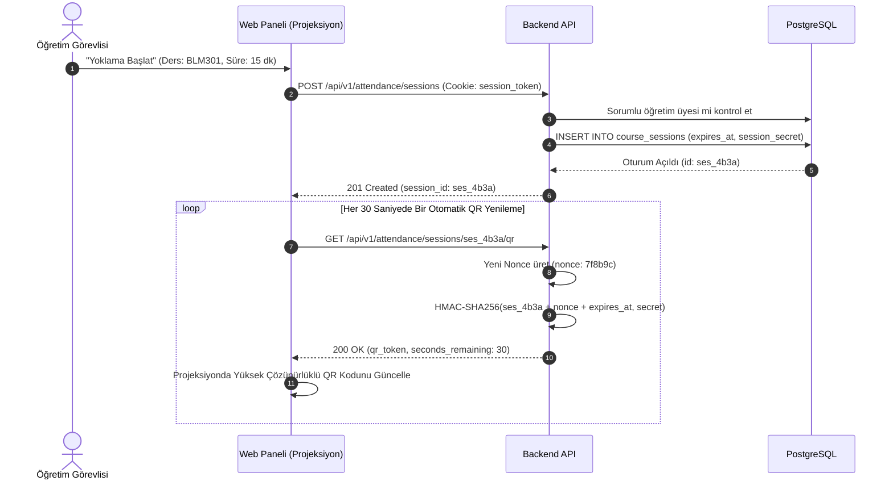
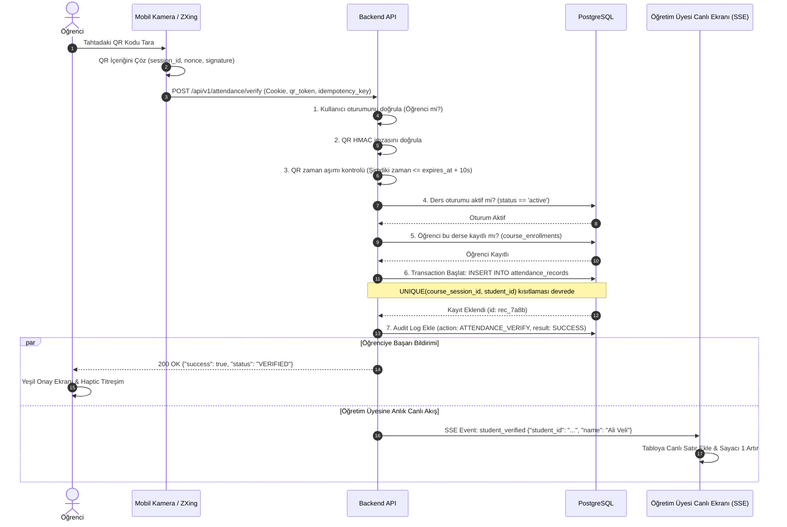
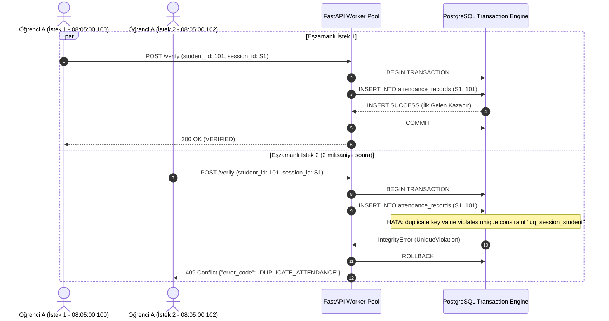

# Yetkili Üniversite Yoklama Sistemi - Sıralama Diyagramları (Sequence Diagrams)

Bu doküman, sistemin temel kullanım senaryolarının katmanlar arasındaki mesajlaşma ve veri akışlarını Mermaid sıralama diyagramları ile modeller.

---

## 1. CAS Kimlik Doğrulama ve Güvenli Oturum Akışı (CAS Authentication Flow)

```mermaid
sequenceDiagram
    autonumber
    actor Student as Öğrenci (Tarayıcı)
    participant Backend as Backend API (FastAPI)
    participant CAS as Fırat CAS Sunucusu
    participant DB as PostgreSQL

    Student->>Backend: GET /api/v1/auth/cas/start
    Backend-->>Student: 302 Redirect -> https://jasig.firat.edu.tr/cas/login?service=...
    Student->>CAS: Kullanıcı Adı & Parola ile Giriş
    CAS-->>Student: 302 Redirect -> /api/auth/cas/callback?ticket=ST-12345
    Student->>Backend: GET /api/v1/auth/cas/callback?ticket=ST-12345
    
    Note over Backend,CAS: Backend arka planda bileti doğrular (Tek Kullanımlık)
    Backend->>CAS: POST /serviceValidate?ticket=ST-12345&service=...
    CAS-->>Backend: 200 OK (XML/JSON: Valid, User: 210101001, Role: student)
    
    Backend->>DB: Kullanıcıyı Bul veya Oluştur (users)
    DB-->>Backend: Kullanıcı Kaydı Onaylandı
    Backend->>DB: Audit Log Yaz (action: CAS_LOGIN, result: SUCCESS)
    
    Note over Backend,Student: Token asla JS'e verilmez; httpOnly çerez yazılır
    Backend-->>Student: 200 OK (Set-Cookie: session_token=...; HttpOnly; Secure; SameSite=Lax)
```

---

## 2. Öğretim Görevlisi Oturum Başlatma ve Dinamik QR Rotasyonu



---

## 3. Öğrenci QR Tarama ve Uçtan Uca Doğrulama Akışı



---

## 4. 100+ Eşzamanlı İstek ve Yarış Koşulu (Race Condition) Önleme


